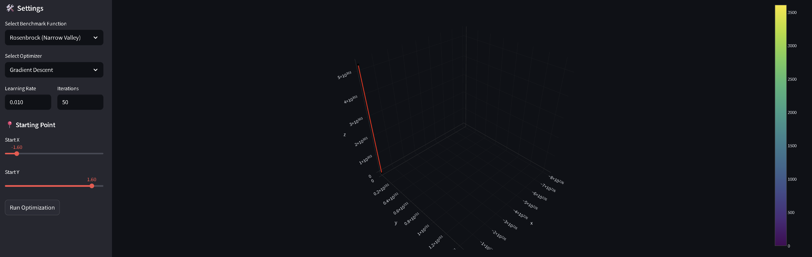
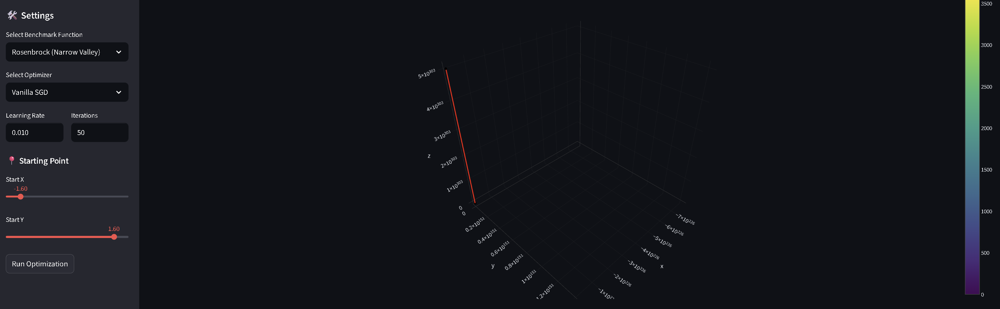

\# Optimization Lab: Mathematical Benchmarking Suite 🧪


A comprehensive visualization tool designed to analyze the behavior of first-order and second-order optimization algorithms across diverse mathematical landscapes. This project serves as a hands-on exploration of \*\*Numerical Optimization\*\* concepts fundamental to Machine Learning and Pattern Recognition.


\## 🚀 Overview


The core objective of this project is to demystify the "black box" nature of optimizers. By implementing algorithms like \*\*Gradient Descent\*\*, \*\*Newton's Method\*\*, and \*\*Stochastic Gradient Descent (SGD)\*\* from scratch (using only NumPy), I aimed to visualize their convergence properties, stability issues, and limitations in handling non-convex functions.


\### Key Features

\* \*\*From-Scratch Implementation:\*\* No high-level ML libraries; pure mathematical logic.

\* \*\*Interactive Dashboard:\*\* Built with Streamlit for real-time hyperparameter tuning.

\* \*\*3D \& Contour Visualizations:\*\* Leveraging Plotly to render complex surfaces.


---


\## 📊 Experimental Results \& Analysis


Below is a detailed breakdown of how different algorithms performed under various conditions.


\### 1. Convex Landscapes (The Sphere Function)

The Sphere function represents the ideal scenario: a smooth, convex surface with a single global minimum.


| Algorithm | Trajectory Visualization | Analysis |

| :--- | :---: | :--- |

| \*\*Gradient Descent\*\* |  | \*\*Stable Convergence:\*\* The path is smooth and direct. Since the gradient always points towards the minimum, GD performs reliably here. |

| \*\*Newton's Method\*\* |  | \*\*Optimal Path:\*\* By utilizing the Hessian matrix (second-order derivative), the algorithm understands the surface curvature and jumps straight to the solution. |

| \*\*Vanilla SGD\*\* |  | \*\*Stochastic Behavior:\*\* The noisy path reflects the introduced randomness, simulating mini-batch training dynamics essential for generalization. |


---


\### 2. Numerical Instability (The Rosenbrock Function)

Known as the "Banana function," this landscape tests an algorithm's ability to navigate a narrow, curved valley. It also highlights the risks of improper hyperparameter tuning.


| Scenario | Visualization | Insight |

| :--- | :---: | :--- |

| \*\*Gradient Explosion (GD)\*\* |  | \*\*Failure Case:\*\* With a learning rate of `0.01`, Gradient Descent diverged. The steep walls caused the steps to overshoot, leading to numerical overflow ($Z \\approx 10^{303}$). |

| \*\*Newton's Stability\*\* |  | \*\*Success Case:\*\* Despite the steep gradients, Newton's Method used curvature information to adjust its step size intelligently, navigating the valley successfully. |

| \*\*Stochastic Instability\*\* |  | \*\*Failure Case:\*\* Similar to GD, standard SGD without adaptive learning rates failed to stabilize in the steep regions. |


---


\### 3. The Local Minima Trap (The Rastrigin Function)

A highly non-convex function with many local minima, simulating the complex loss landscapes of Deep Neural Networks.


| Algorithm | Outcome | Analysis |

| :--- | :---: | :--- |

| \*\*Gradient Descent\*\* |  | \*\*Trapped:\*\* The algorithm got stuck in a local minimum near the starting point, unable to climb out of the "well." |

| \*\*Newton's Method\*\* |  | \*\*Ineffective:\*\* In highly oscillating environments, the Hessian matrix fluctuates rapidly, rendering second-order updates unreliable. |

| \*\*Vanilla SGD\*\* |  | \*\*Exploration:\*\* The stochastic noise helps the algorithm explore the space better than GD, though tuning is critical to avoid aimless wandering. |


---


\## 🛠️ How to Run Locally


To explore these visualizations on your own machine:


1\.  \*\*Clone the repository:\*\*

&nbsp;   ```bash

&nbsp;   git clone \[https://github.com/aminizahra/Optimization-Lab.git](https://github.com/aminizahra/Optimization-Lab.git)

&nbsp;   cd Optimization-Lab

&nbsp;   ```


2\.  \*\*Install dependencies:\*\*

&nbsp;   ```bash

&nbsp;   pip install numpy streamlit plotly

&nbsp;   ```


3\.  \*\*Launch the dashboard:\*\*

&nbsp;   ```bash

&nbsp;   python -m streamlit run app.py

&nbsp;   ```


\## 🧠 Theory \& Math


\* \*\*Gradient Descent:\*\* $x\_{t+1} = x\_t - \\eta \\nabla f(x\_t)$

\* \*\*Newton's Method:\*\* $x\_{t+1} = x\_t - \[H f(x\_t)]^{-1} \\nabla f(x\_t)$

&nbsp;   \* \*Note:\* While Newton's method is faster in steps, computing $H^{-1}$ is computationally expensive ($O(n^3)$), making it impractical for large-scale Deep Learning models.


---


\*Project developed by \[Zahra Amini](https://aminizahra.github.io/) as part of the Pattern Recognition \& AI Portfolio.\*

